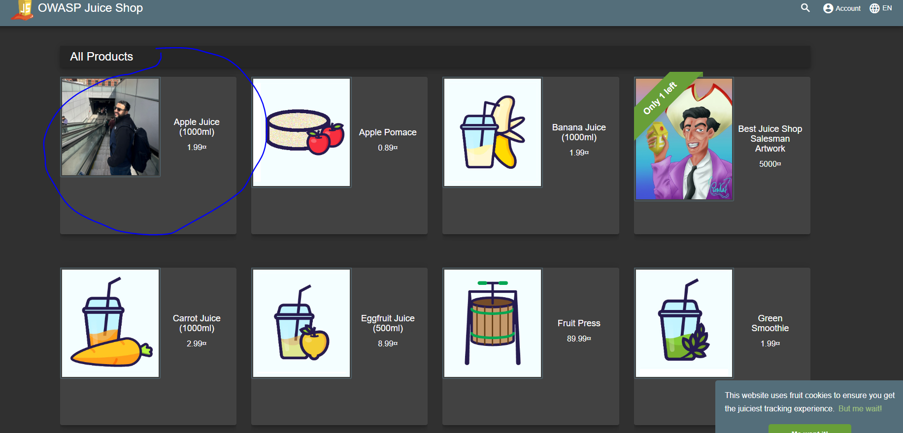

# Steps to Run the Application

1. Open the terminal.
2. Navigate to the application directory using the `cd` command.
3. Run the command `npm start` to start the application.
4. Open a web browser and go to [http://localhost:3000](http://localhost:3000).
5. The application homepage should be displayed.

## Homepage

Here is a screenshot of the homepage:

The step how to change the weboag photo in the main page:
I choose the OWASP Juice Shop project and choosed to changed the papple, juice photo in the home page with my own photo. 
1. I entered to the frontend folder in the juice-shop project. 
Fontend - src - assets- public - images- products-.
2. changed the apple_juice.jgp with my ount photo with the same subject.
3. go to the git bash.
4. enter command git add.
5. enter command git commit "image changed".
6. enter command git push.
7. in the application the image was changed screenshot attached.

Here is a screenshot of the homepage with my image:

